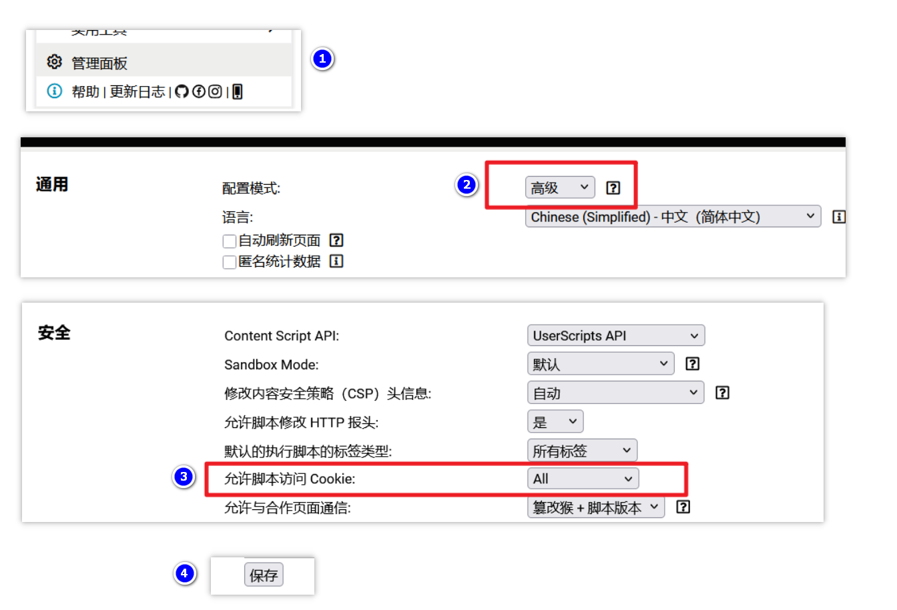

中文 | [English](./README_en.md)

---

  

<h1 align="center">AnMe</h1>

  通用多网站多账号切换器

---

​      [AnMe](https://github.com/Zhu-junwei/AnMe) 是一款基于 [篡改猴](https://www.tampermonkey.net/) / [脚本猫](https://scriptcat.org) 浏览器插件开发的多网站多账号管理切换脚本。它通过“快照”机制，一键保存并恢复网站的登录状态（Cookie、LocalStorage 和 SessionStorage），助您在同一个浏览器窗口中实现多账号无缝切换。

## ✨ 主要功能

- **⚡ 快速切换**：为不同账号保存独立快照，点击即可瞬间切换。
- **📂 全面存储**：支持同时备份 **Cookie**、**LocalStorage (LS)** 和 **SessionStorage (SS)**。
- **🌍 跨站管理**：支持查看和管理非当前域名的其他网站账号记录。
- **📦 数据备份**：支持导出当前网站或全部数据为 JSON 文件，方便跨设备迁移。
- **🎨 智能交互**：
  - **悬浮球设计**：支持自由拖拽定位。
  - **多种显示模式**：智能显隐、常驻显示或完全隐藏（通过菜单唤起）。
  - **拖拽排序**：在管理面板中可通过拖拽调整账号顺序。
- **🌐 多语言支持**：支持简体中文、英文、西班牙语。

## 🏠 运行截图

## 🚀 安装步骤

1. **准备环境**：确保您的浏览器已安装 [篡改猴Tampermonkey](https://www.tampermonkey.net/) 或 [脚本猫ScriptCat](https://scriptcat.org) 插件。

2. **篡改猴设置权限 (重要)**：

   - 为了脚本能正常读取和保存 Cookie，请进入 **“篡改猴管理面板”**。
   - 点击 **“设置”**，将 **“通用” -> “配置模式”** 改为 **“高级”**。
   - 找到 **“安全” -> “允许脚本访问 Cookie”**，将其设置为 **“ALL”**，在下方记得点击**“保存”**。

   

   >  [脚本猫ScriptCat](https://scriptcat.org) 不需要额外的设置，当检测到需要权限时会提醒您进行选择。

3. **安装脚本**

 - 可以选择在 [Greasy Fork](https://greasyfork.org/zh-CN) 中找到 AnMe 脚本来 [安装](https://greasyfork.org/zh-CN/scripts/563142-anme)，这里的代码和Github是同步更新的。
 - 或在Github将 [AnMe](https://github.com/Zhu-junwei/AnMe) 仓库中的js代码复制到插件中保存。

## 🛠️ 使用指南

### 1. 保存账号

- 在需要保存账号的网页中（通常是网站的首页），找 [篡改猴](https://www.tampermonkey.net/) / [脚本猫](https://scriptcat.org) 插件中的AnMe脚本， 点击 **🚀 开启账号管理** 菜单打开账号管理面板。
- 进入 **管理账号** 标签页。
- 输入账号名称，勾选需要保存的数据类型（建议至少勾选 Cookie，如切换登录失败，尝试勾选 LocalStorage 和 SessionStorage后重新保存账号）。
- 点击 **保存当前账号** 后，账号会以“快照”的方式保留在脚本中。如需添加多个账号，点击旁边的**“+” (切换新环境)** 按钮登录新的账号保存即可。

> 账号保存后，不要使用原本网站的退出账号功能，这会让已经保存到脚本中的账号快照失效。可以使用脚本的 **“+” (切换新环境)** 来退出当前网站已经登录的账号。

### 2. 切换账号

- 在 **账号切换** 标签页中，点击对应的账号卡片后即可切换账号。
- 脚本会退出当前已经登录的账号，切换成你选择的账号进行登录并刷新网页。
- 在账号的下面你会看到`CK`、`LS`、`SS` 这样的小按钮，这是脚本所保存的账号信息，点击后可以查看具体的内容。

> 添加的账号并不会一直生效，这取决网站自身给账号设置的登录过期时间。一个可行的方式是切换登录后尝试重新保存同名的账号，这会重新刷新账号快照状态，延长过期时间。

### 3. 导入导出

**导出数据：**

- 在 **高级设置** 标签页中，脚本提供了导出脚本中保存的 **当前网站** 和 **所有网站** 的账号数据，导出后是一个json格式的文件，你需要妥善保管这些备份数据。

**导入数据：**

- 有了导出数据，你可以选择在 **任意电脑 / 浏览器** 安装了 [AnMe](https://github.com/Zhu-junwei/AnMe) 脚本重新导入他们。如果尝试进行切换账号登录，你会发现依然好用，并且没有要求输入的账号密码。

> 切换新账号并不总是成功的，不同的网站对安全性要求也不一样。高级一点的网站会使用诸如 **[浏览器指纹](https://zhuanlan.zhihu.com/p/10758691067)** 的技术来识别用户状态，这就要根据具体的网站来判断。

## 🔒 隐私与安全

- **本地存储**：所有数据均通过 `GM_setValue` 存储在您的本地浏览器中，脚本没有任何联网权限，**不会上传任何数据**到服务器。
- **风险提示**：由于脚本管理器环境的开放性，请勿在公共电脑或不可信的设备上保存敏感账号。

## 📄 免责声明

本脚本仅供学习交流使用。因使用本脚本导致的账号封禁、数据泄露或任何形式的损失，作者不承担任何法律责任。请在确保环境安全的前提下谨慎使用。

------

## ☕支持作者

**如果您觉得好用，可以通过下方二维码支持我或给项目点个star，这是对我最大的鼓励。**

|        微信赞赏        |         支付宝         |
| :--------------------: | :--------------------: |
|  |  |