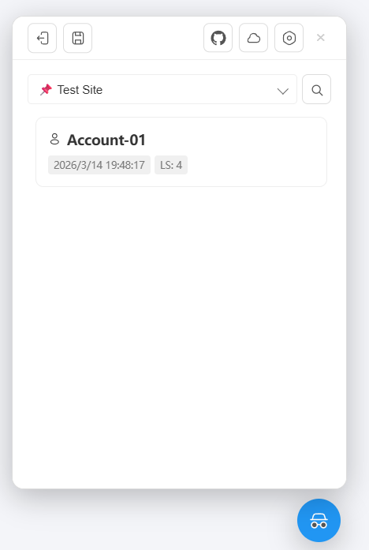
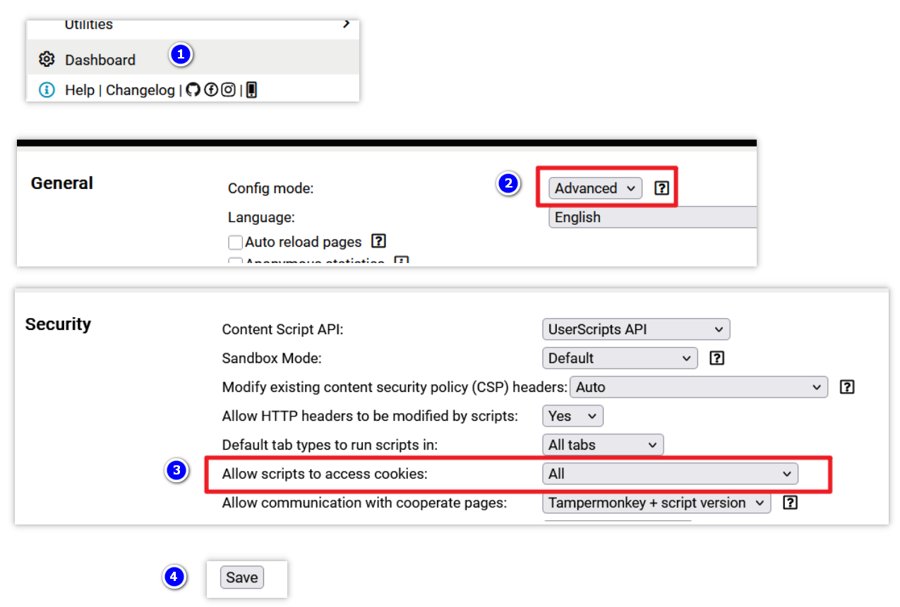

[中文](./README_zh.md) | English

---

  

<h1 align="center">AnMe</h1>

Universal Multi-Site Multi-Account Switcher

---

[AnMe](https://github.com/Zhu-junwei/AnMe) is a userscript for [Tampermonkey](https://www.tampermonkey.net/) and [ScriptCat](https://scriptcat.org) that saves and restores login snapshots for multiple websites. It captures Cookies, LocalStorage, and SessionStorage so you can switch between accounts in the same browser window without re-entering credentials every time.

## Highlights

- Fast account switching with one-click snapshot restore
- Save Cookies, LocalStorage, and SessionStorage together
- Cross-site account management from a single floating panel
- Site name support with domain fallback for older records
- Import and export local backups as JSON files
- Optional WebDAV cloud backup and restore
- Draggable floating button with auto, always-show, and hidden modes
- Account search, site search, and drag-and-drop ordering
- Simplified Chinese, English, and Spanish UI

## Screenshots

## Installation

1. Install [Tampermonkey](https://www.tampermonkey.net/) or [ScriptCat](https://scriptcat.org).
2. For Tampermonkey, enable Cookie access:
   - Open the Tampermonkey dashboard.
   - Go to `Settings`.
   - Change `Config mode` to `Advanced`.
   - In `Security`, set `Allow scripts to access cookies` to `ALL`.
   - Save the settings.

   

   ScriptCat does not require this extra step. It asks for permission when needed.

3. Install the script:
   - [Install from Greasy Fork](https://greasyfork.org/scripts/563142-anme)
   - Or build from this repository and install the generated `AnMe.user.js`

## Basic Usage

### Save an account

1. Log in to the website you want to save.
2. Open the floating panel.
3. Click the save button.
4. Confirm the site name and account name.
5. Choose which data types to store.
6. Save the snapshot.

If the current website already has saved accounts, the save dialog focuses the account name field first so you can add another account quickly.

### Switch an account

1. Open the panel on the target site.
2. Pick an account card.
3. The script clears the current environment, restores the selected snapshot, and reloads the page.

You can inspect stored `CK`, `LS`, and `SS` data directly from the account card tags.

### Manage sites and accounts

- The site dropdown can display either saved site names or plain domains.
- If an old record has no saved site name, AnMe keeps showing the domain instead of mixing in the current page title.
- Account names are independent per site, while the site name is shared across accounts on the same domain.

## Backup and Restore

### Local backup

- Export the current site or all saved data as JSON
- Import a JSON backup on another browser or machine
- Clear all script data from the advanced settings page

### WebDAV cloud backup

AnMe includes an optional WebDAV sync page:

- Configure server URL, username, and password
- Verify credentials before saving
- Upload the current local data as a single `.anme` backup file
- View cached backup metadata locally for faster page entry
- Manually refresh the cloud list when needed
- Restore from any cloud backup
- Delete cloud backups
- Sign out and remove saved local WebDAV credentials

WebDAV requests use a timeout to avoid leaving the panel stuck in a loading state.

## Privacy and Security

- Local data is stored through `GM_setValue` in your userscript manager.
- AnMe does not upload anything by default.
- Network access is only used when you explicitly configure and use WebDAV sync.
- Snapshot validity still depends on each website's own session policy.
- Do not store sensitive accounts on public or untrusted devices.

## Limitations

- Some websites bind sessions to device signals, browser fingerprints, or server-side risk controls.
- On those sites, restoring Cookies and storage data may still fail.
- Re-saving an account after a successful login can refresh an expired snapshot.

## Development

Source entry: `src/main.js`

Available scripts:

- `npm test`
- `npm run build`

Build output:

- `AnMe.user.js`

## Support

If this project is useful to you, give it a star or support the author.

| WeChat Pay | Alipay |
| :--: | :--: |
|  |  |
