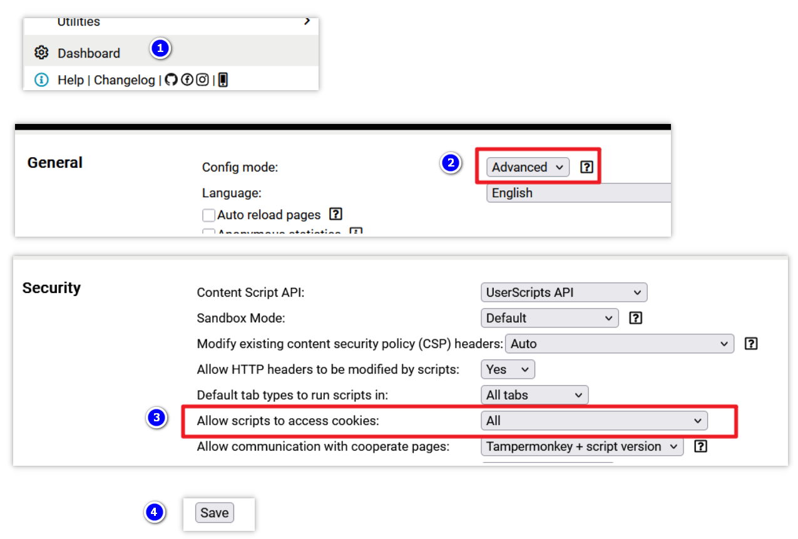

[中文](./README.md) | English

---

<h1 align="center">AnMe</h1>

Universal Multi-Website Multi-Account Switcher

---

[AnMe](https://github.com/Zhu-junwei/AnMe) is a multi-account management and switching script developed for [Tampermonkey](https://www.tampermonkey.net/) and [ScriptCat](https://scriptcat.org) browser extensions. Using a "snapshot" mechanism, it saves and restores website login states (Cookies, LocalStorage, and SessionStorage) with one click, allowing you to switch between multiple accounts seamlessly within the same browser window.

## ✨ Key Features

- **⚡ Fast Switching**: Save independent snapshots for different accounts and switch instantly with a single click.
- **📂 Full Data Storage**: Supports simultaneous backup of **Cookies**, **LocalStorage (LS)**, and **SessionStorage (SS)**.
- **🌍 Cross-Site Management**: View and manage account records for websites other than the one you are currently visiting.
- **📦 Data Backup**: Export data for a specific site or all saved data as a JSON file for easy migration across devices.
- **🎨 Intuitive UI**:
  - **Floating Ball**: Draggable interface for flexible positioning.
  - **Multiple Display Modes**: Smart auto-hide, always visible, or completely hidden (invoked via the extension menu).
  - **Drag-and-Drop Sorting**: Adjust the order of your accounts in the management panel easily.
- **🌐 Multi-language Support**: Supports Simplified Chinese, English, and Spanish.

## 🏠 Screenshots

## 🚀 Installation Steps

1. **Prepare Environment**: Ensure your browser has the [Tampermonkey](https://www.tampermonkey.net/) or [ScriptCat](https://scriptcat.org) extension installed.
2. **Tampermonkey Permission Settings (Crucial)**:
* To allow the script to read and save Cookies, open the **Tampermonkey Dashboard**.
* Go to **Settings**, and change **"General" -> "Config mode"** to **"Advanced"**.
* Locate **"Security" -> "Allow scripts to access cookies"**, set it to **"ALL"**, and remember to click **Save** at the bottom.

  

> [ScriptCat](https://scriptcat.org) does not require extra settings; it will prompt you for permission when needed.

3. **Install the Script**:
* Install via [Greasy Fork](https://www.google.com/search?q=https://greasyfork.org/scripts/563142-anme). The code here stays synchronized with GitHub.
* Alternatively, copy the JS code from the [AnMe](https://github.com/Zhu-junwei/AnMe) GitHub repository and create a new script in your extension.

## 🛠️ Usage Guide

### 1. Saving an Account

* On the page where you want to save an account (usually the home page), find the AnMe script in the extension menu and click **🚀 Open Account Manager**.
* Go to the **Manage Accounts** tab.
* Enter an account name and select the data types to save (it is recommended to select Cookies at minimum; if switching fails, try selecting LocalStorage and SessionStorage as well).
* Click **Save Current Account**. The account is now stored as a "snapshot." To add more accounts, click the **"+" (Switch to New Environment)** button to log into a new account and repeat the process.

> **Note**: After saving an account, do **not** use the website's native "Logout" button, as this often invalidates the session stored in your snapshot. Instead, use the script's **"+" (Switch to New Environment)** feature to clear the current session.

### 2. Switching Accounts

* In the **Account Switch** tab, click on an account card to switch.
* The script will clear the current session, apply the selected snapshot, and refresh the page.
* Below the account name, you will see buttons like `CK`, `LS`, and `SS`. These represent the saved data; click them to view specific content.

> Account snapshots are subject to the website's own expiration policy. A good practice is to periodically "re-save" an existing account name while logged in to refresh the snapshot and extend the session.

### 3. Import & Export

**Exporting Data:**

* In the **Advanced Settings** tab, you can export data for the **current site** or **all sites**. This generates a JSON file. Please keep this file secure.

**Importing Data:**

* You can import your JSON backup into AnMe on **any computer or browser**. Once imported, you can switch to those accounts immediately without re-entering passwords.

> **Note**: Switching accounts may not work on all websites. Some high-security sites use **[Browser Fingerprinting](https://www.google.com/search?q=Browser Fingerprinting)** or hardware-bound sessions to verify users, which this script cannot bypass.

## 🔒 Privacy & Security

* **Local Storage**: All data is stored locally in your browser via `GM_setValue`. The script has no network permissions and **will never upload your data** to any server.
* **Risk Warning**: Due to the open nature of browser script managers, do not use this script to save sensitive accounts on public computers or untrusted devices.

## 📄 Disclaimer

This script is for educational and exchange purposes only. The author is not responsible for account bans, data leaks, or any form of loss resulting from the use of this script. Please use it with caution in a secure environment.

---

## ☕ Support the Author

**If you find this tool helpful, you can support me via the QR codes below or give the project a star. It is the greatest encouragement for me.**

| Wechat Pay | Alipay |
| :--------------------: | :--------------------: |
|  |  |