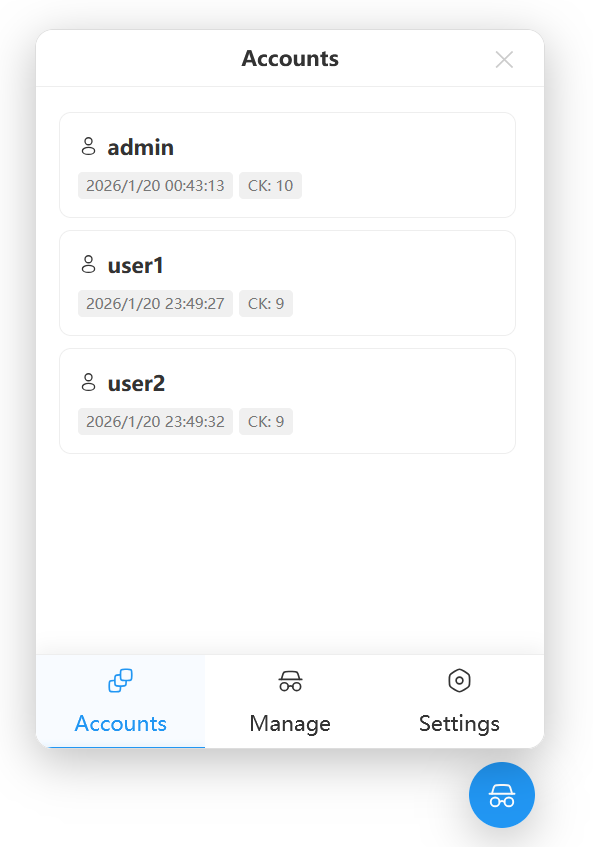

[中文](./README.md) | English

---

# 👥 AnMe - Universal Multi-Site Account Switcher

[AnMe](https://github.com/Zhu-junwei/AnMe) is an open-source browser script developed for [Tampermonkey](https://www.tampermonkey.net/) designed to manage and switch between multiple website accounts. It utilizes a "snapshot" mechanism to save and restore website login states (Cookies, LocalStorage, and SessionStorage) with one click, enabling seamless account switching within the same browser window.

## ✨ Key Features

* **⚡ Fast Switching**: Save independent snapshots for different accounts and switch instantly with a single click.
* **📂 Comprehensive Storage**: Supports simultaneous backup of **Cookies**, **LocalStorage (LS)**, and **SessionStorage (SS)**.
* **🌍 Cross-Site Management**: View and manage account records for websites other than the current domain.
* **📦 Data Backup**: Export data for the current site or all saved data as JSON files for easy migration across devices.
* **🎨 Intelligent Interaction**:
* **Floating Button**: Supports free dragging and positioning.
* **Multiple Display Modes**: Smart Hide, Always Show, or Completely Hidden (accessible via the Tampermonkey menu).
* **Drag-and-Drop Sorting**: Adjust the order of accounts in the management panel by dragging.

* **🌐 Multi-language Support**: Supports both Simplified Chinese and English.

## 🏠 Screenshots

## 🚀 Installation Steps

1. **Prepare the Environment**: Ensure the [Tampermonkey](https://www.tampermonkey.net/) extension is installed in your browser.
2. **Set Permissions (Crucial)**:
* To ensure the script can properly read and save Cookies, go to the **Tampermonkey Dashboard**.
* Click **"Settings"**, and change the **"Config mode"** at the bottom from **"Basic"** to **"Advanced"**.
* Locate **"Security" -> "Allow scripts to access cookies"** and set it to **"ALL"**.

3. **Install the Script**: Click the [install](https://greasyfork.org/zh-CN/scripts/563142) button for the script file or copy the code into a new script and save.

## 🛠️ User Guide

### 1. Saving an Account

* Click the blue user icon floating button on the page.
* Navigate to the "Manage" (Manage Accounts) tab.
* Enter an account name and check the data types you wish to save (it is recommended to at least check Cookies; if switching fails, try checking LocalStorage and SessionStorage as well).
* Click **"Save Current"**.

### 2. Switching Accounts

* In the "Accounts" (Account Switch) tab, click the corresponding account card.
* The page will automatically refresh and apply the saved login state.

### 3. Creating a New Environment

* Click the **"+" (New Environment)** button.
* The script will clear all Cookies and storage traces for the current site, allowing you to log in to a new account as if using a fresh browser.

## 🔒 Privacy & Security

* **Local Storage**: All data is stored locally in your browser via `GM_setValue`. The script has no network permissions and **will never upload your data** to any server.
* **Risk Warning**: Due to the open nature of browser script managers, do not use this script to save sensitive accounts on public computers or untrusted devices.

## 📄 Disclaimer

This script is for educational and exchange purposes only. The author is not responsible for account bans, data leaks, or any form of loss resulting from the use of this script. Please use it with caution in a secure environment.

---

## ☕ Support the Author

**If you find this tool helpful, you can support me via the QR codes below or give the project a star. It is the greatest encouragement for me.**

| Wechat Pay | Alipay |
| :--------------------: | :--------------------: |
|  |  |