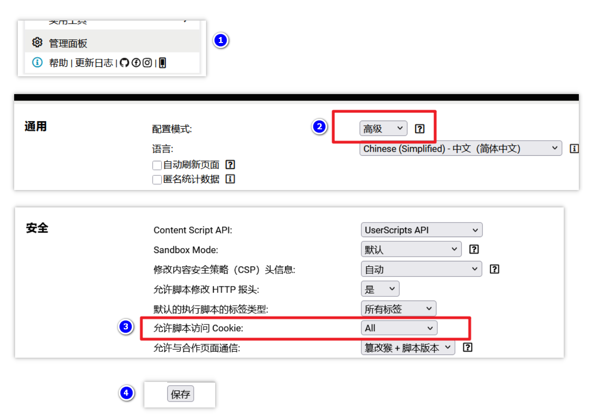

中文 | [English](./README.md)

---

  

<h1 align="center">AnMe</h1>

通用多网站多账号切换器

---

[AnMe](https://github.com/Zhu-junwei/AnMe) 是一个运行在 [Tampermonkey](https://www.tampermonkey.net/) 和 [ScriptCat](https://scriptcat.org) 上的多账号快照切换脚本。它会保存网站的 Cookie、LocalStorage 和 SessionStorage，让你在同一个浏览器窗口里快速切换多个账号。

## 功能概览

- 一键保存和切换账号快照
- 同时保存 Cookie、LocalStorage、SessionStorage
- 在同一个面板里管理多个网站的账号
- 支持站点名字显示，并兼容历史数据回退到域名
- 支持本地 JSON 备份与导入
- 支持可选的 WebDAV 云备份与恢复
- 悬浮球可拖拽，支持智能、常驻、隐藏三种模式
- 支持站点搜索、账号搜索、账号拖拽排序
- 支持简体中文、英文、西班牙语

## 运行截图

## 安装方式

1. 安装 [Tampermonkey](https://www.tampermonkey.net/) 或 [ScriptCat](https://scriptcat.org)。
2. 如果你使用 Tampermonkey，需要先开启 Cookie 权限：
   - 打开 Tampermonkey 管理面板
   - 进入 `Settings`
   - 将 `Config mode` 改为 `Advanced`
   - 在 `Security` 中把 `Allow scripts to access cookies` 改成 `ALL`
   - 保存设置

   

   ScriptCat 不需要这一步，缺少权限时会自动提示。

3. 安装脚本：
   - [从 Greasy Fork 安装](https://greasyfork.org/scripts/563142-anme)
   - 或者自行构建并安装仓库生成的 `AnMe.user.js`

## 基本使用

### 保存账号

1. 登录你要保存的网站账号。
2. 打开悬浮面板。
3. 点击保存按钮。
4. 确认站点名称和账号名称。
5. 选择需要保存的数据类型。
6. 保存快照。

如果当前网站已经有账号记录，保存弹窗会优先聚焦到“账号名称”，方便你继续添加新账号。

### 切换账号

1. 在目标网站打开面板。
2. 点击要切换的账号卡片。
3. 脚本会清空当前环境、恢复对应快照并刷新页面。

账号卡片下方的 `CK`、`LS`、`SS` 标签可以直接查看已保存的数据内容。

### 管理站点和账号

- 站点下拉列表可以切换为显示“站点名字”或“域名”
- 如果历史记录没有保存站点名字，AnMe 会稳定显示域名，不会临时改成当前页面标题
- 同一个域名下站点名字一致，账号名字彼此独立

## 备份与恢复

### 本地备份

- 导出当前网站数据
- 导出全部网站数据
- 从 JSON 文件导入备份
- 在高级设置里清空全部脚本数据

### WebDAV 云备份

AnMe 提供可选的 WebDAV 云同步页面，支持：

- 配置服务器地址、用户名和密码
- 验证后保存账号信息
- 将当前本地数据打包成单个 `.anme` 备份文件上传
- 先从本地缓存读取备份列表元数据，减少页面进入时的等待
- 手动刷新云端备份列表
- 从任意云端备份恢复
- 删除云端备份
- 退出 WebDAV 并清除本地保存的账号信息

所有 WebDAV 请求都带超时控制，避免长时间停留在 loading 状态。

## 隐私与安全

- 本地数据通过 `GM_setValue` 保存在脚本管理器中
- 脚本默认不会主动上传任何数据
- 只有在你手动配置并使用 WebDAV 同步时，脚本才会访问远程服务
- 快照是否仍然有效，取决于网站本身的登录策略
- 不建议在公共电脑或不可信设备上保存敏感账号

## 已知限制

- 某些网站会结合设备环境、浏览器指纹、风控策略校验登录态
- 这类网站即使恢复了 Cookie 和存储数据，也可能无法直接切换成功
- 如果账号快照过期，可以在重新登录后覆盖保存同名账号来刷新状态

## 开发说明

源码入口：`src/main.js`

常用命令：

- `npm test`
- `npm run build`

构建产物：

- `AnMe.user.js`

## 支持作者

如果这个项目对你有帮助，欢迎点个 Star，或者支持作者。

| 微信赞赏 | 支付宝 |
| :--: | :--: |
|  |  |
